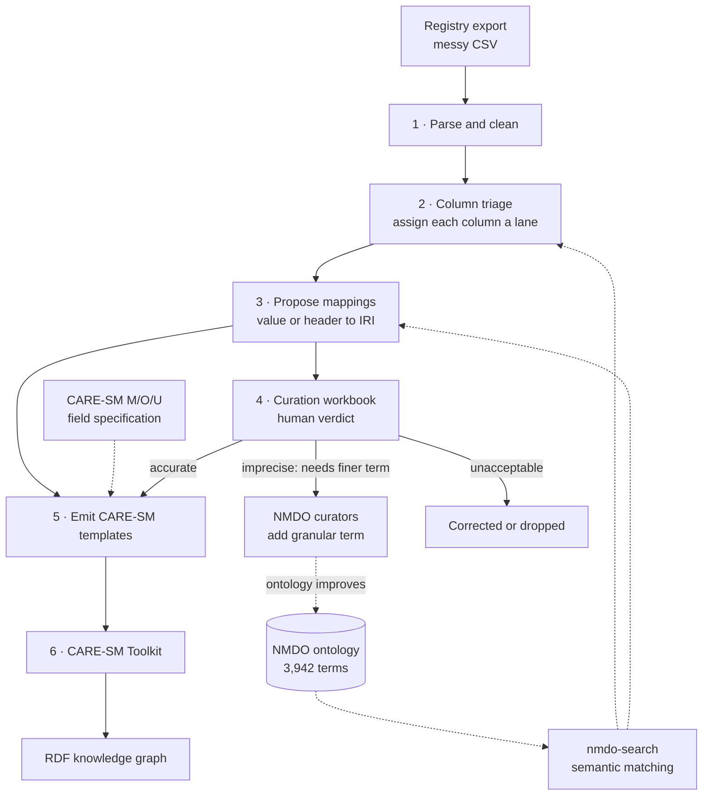
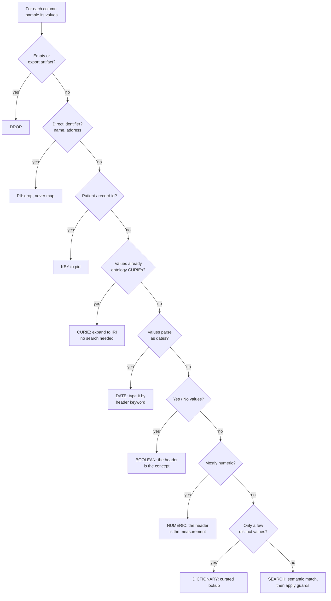

# Spreadsheet → CARE-SM: how the pipeline works

Turning a clinician's registry export into a valid CARE-SM model — and knowing, at
every step, which decision was made and how confident we are in it.

This document is the "how it actually works" companion to [README.md](README.md),
which records the original speculations. Diagrams render directly on GitHub.

**Status:** 7 CARE-SM (v2) models generating end-to-end · validated on 2 datasets
(90 patients) · negative observations now captured.

> **Update — CARE-SM v2 & negation (2026-07).** The transformer now targets
> **CARE-SM v2**. The ontology code lives in `target` (Phenotype/Diagnosis/
> Symptoms_onset) or `attribute_type` (Sex/Status), and `value` is a typed
> literal. Crucially, the "negatives withheld" limitation in §7 is **resolved**:
> a confirmed-absent finding is now a first-class `value=false` row. Output was
> verified through the actual v2 Toolkit (see §6).

---

## 1. The workflow at a glance

Six stages. Triage is deliberately separated from transformation: the profiler only
ever *reads* and reports, so its judgement can be inspected and corrected before a
single output row is written.

Dotted lines are resources consulted, not data flow.

Note the loop at stage 4: an **"imprecise" verdict is not a failure** — it is a request
for a new ontology term. Curators annotate data and, in the same motion, tell the
ontology maintainers exactly where NMDO lacks granularity. The ontology improves as
the data is mapped.

---

## 2. Where the decisions actually happen

This is the heart of the system. Every column is tested against an **ordered** sequence
of cheap, high-confidence checks before any expensive or fallible semantic search is
attempted. Order matters: identifiers and dates are settled before anything is sent to
an embedding model.

Nine outcomes, first match wins. Only the final branch reaches the semantic search —
most columns are settled deterministically, which is both faster and far safer.

### Three ways a column can carry meaning

A column that "looks like a phenotype" can be any of three structurally different
things. Detecting which is what determines the transform:

| Pattern | Header maps? | Cell maps? | Example | What the cell means |
|---|---|---|---|---|
| Cell-as-concept | no | **yes** | `pheno = "scoliosis"` | the value is the term |
| Header-as-measurement | **yes** | no (numeric) | `10MWT = 8.4` | the value is a quantity |
| Header-as-concept | **yes** | boolean | `cardiomyopathy = Yes` | the value is presence |

The third pattern is common in real registries and was not anticipated in the original
design — it emerged from the partner's data.

---

## 3. The original speculations, tested

Each speculation from [README.md](README.md) survived, but none survived unmodified.
The corrections are the most useful part of the result.

| # | The claim | Verdict | What we found |
|---|---|---|---|
| 1 | If sampled values get hits, the column is mappable | **True but insufficient** | An embedding search *always* returns a ranked hit — including for free-text comments and hospital names. A distractor even outscored a real signal. "Hits" alone is not evidence. |
| 2 | The ontology branch tells you the CARE-SM data type | **Directionally right** | Holds for HPO→Phenotype and MONDO→Diagnosis. Breaks where one vocabulary serves many types (NCIT appears in six-plus models), and the prefix never tells you the column's *role* within a model. |
| 3 | Detect the model, extract its columns, emit a template | **Confirmed, with a correction** | It works — but it is an *assembly*, not a column extraction. One output row draws on a data cell, a header mapping, a date from a different column, and external knowledge. |

---

## 4. What we assemble from

Nothing here was built from scratch. The work was deciding how existing assets combine
— and discovering where they don't reach.

| Resource | What it gives us |
|---|---|
| **NMDO** | 3,942 indexed terms: MONDO 2,748 · HGNC ~915 · UBERON 848 · HP 329 · NCIT 43. Strong on disease, phenotype, anatomy, genes. |
| **nmdo-search** | Semantic (embedding) search over NMDO. Returns score, IRI, ontology prefix and label for any free-text query. |
| **CARE-SM model** | ~18 clinical observation types. Critically, its *glossary* marks every field of every model Mandatory, Optional or Unused. |
| **CARE-SM Toolkit** | Consumes per-type template CSVs and produces RDF. Our output target. |
| **Partner dataset** | 60 patients, 35 columns. Real-shaped and unusually clean: pre-coded ORPHA diagnoses, categorical vocabularies, Yes/No clinical flags. |
| **Adversarial dataset** | 30 patients, 16 columns, built deliberately to break things: multi-value cells, negations, missing units, a composite scale, two semantic distractors. See [SYNTHETIC-TEST-DATA-COOKBOOK.md](SYNTHETIC-TEST-DATA-COOKBOOK.md). |

> **The gap that policy can't fix.** Partners agreed we may use ontologies outside the
> CARE-SM specification, which removed the vocabulary-mismatch problem. It does *not*
> create coverage: NMDO contains **zero** measurement units, and effectively no drugs or
> specimen types. Laboratory and Medication therefore cannot be fully populated from
> NMDO alone, no matter how good the search is.

---

## 5. Stage detail

### 5.1 Why "did it get a hit?" isn't enough

We calibrated the search against known-good and known-bad queries before trusting any
threshold. Two findings changed the design.

**Finding 1 — the scores are low.** Good matches land around `0.50`–`0.88`, not the
textbook `0.9`. An exact "Duchenne muscular dystrophy" match scored just `0.33` on a
bare one-word query. Any threshold inherited from a tutorial would have rejected
everything.

**Finding 2 — a distractor beat a real signal.** The comment *"reports difficulty
walking long distances"* scored `0.574`, while the genuine phenotype *"foot drop"*
scored `0.42`. No single score threshold can separate those.

**The fix — a hit-fraction guard.** Judge the **column**, not the value. A genuine
phenotype column produces confident hits on *most* of its rows; a comments column
produces a scattered few. A column is accepted only if at least **60%** of its sampled
values clear a score of **0.50**. Individual values remain fallible; the column-level
statistic is robust.

| Column | Dataset | Hit fraction | Outcome |
|---|---|---:|---|
| `diagnosis` | adversarial | 1.00 | accepted |
| `pheno` | adversarial | 0.89 | accepted |
| `comments` | adversarial | 0.26 | **rejected — distractor** |
| `Gene` | partner (unseen) | 0.10 | **rejected — needs lookup** |

**The result that matters:** the guard rejected `Gene` in the partner's *real* data — a
column we had never designed against. Gene symbols like `SCN4A` are a controlled
vocabulary needing an identifier lookup, not fuzzy matching. The guard reached the right
decision for a reason we hadn't anticipated, which is the strongest evidence it
generalises.

### 5.2 Keeping a human in the loop

Automated mapping is a proposal, not a fact. Every fuzzy mapping is written to an Excel
workbook where a curator records one of three agreed verdicts from a locked drop-down:

| Verdict | Meaning | Consequence |
|---|---|---|
| **accurate mapping** | correct and precise | flows through unchanged |
| **imprecise mapping** | correct but too coarse | **feeds back to the ontology** — NMDO needs a finer term |
| **unacceptable mapping** | wrong | corrected or dropped |

Deterministic routes — pre-coded identifiers, dates, keys, dropped PII — are excluded
from the workbook, so reviewers only spend attention where judgement was actually
exercised.

### 5.3 Emitting a structurally valid template

This stage produced the sharpest correction of the project. We initially matched our
output against CARE-SM's published *example* CSVs — and were wrong to. The examples
contain fields the model marks Unused and omit fields it marks Optional.

The authoritative source is the CARE-SM **glossary**, which marks every field of every
model **M**andatory, **O**ptional or **U**nused. We encoded that table for all 18
models. Each CSV header is now *derived* from the spec — Mandatory and Optional fields
only, in canonical order — so structure is correct by construction rather than by
imitation.

Three consequences, each a silent error before:

- `value_datatype` is **per model** — Unused for Sex, Phenotype and Diagnosis, but
  Mandatory for Symptoms_onset, Medication and Disability. A single global header cannot
  be right.
- `value` now carries the human-readable label of the mapped IRI, so a curator can read
  a row without resolving identifiers.
- `event_id` groups observations from one clinical visit into the RDF quad's context. We
  have no visit-grouping information, so the column is present but **deliberately
  blank** — we removed the synthesised value rather than fabricate a grouping the source
  data never asserted.

---

## 6. How we know it works

### Models delivered

Seven CARE-SM models generate end-to-end from both datasets. Row counts are
*adversarial / partner*.

| Model | Rows | Mapping route | Notable decision |
|---|---:|---|---|
| Phenotype | 68 / 120 | semantic search + boolean flags | negatives captured as `value=false` (v2) |
| Diagnosis | 28 / 60 | free text → MONDO; CURIE → ORDO | pre-coded values bypass search |
| Sex | 30 / 60 | curated lookup | prefers "sex at birth" column |
| Birthdate | 30 / 60 | deterministic | — |
| Deathdate | 3 / 5 | deterministic | only patients with a death date |
| Symptoms_onset | 29 / 57 | deterministic | onset date ≠ record date |
| Status | — / 60 | curated lookup | alive / dead from a Yes-No column |

### Mapping quality, independently spot-checked

Every emitted Phenotype term was re-resolved against the ontology-backed search. This
distribution is the honest picture — and exactly why the curation workbook exists.

| Source value | Mapped to | Assessment |
|---|---|---|
| difficulty climbing stairs | `HP_0003551` Difficulty climbing stairs | accurate |
| scoliosis | `HP_0002650` Scoliosis | accurate |
| cardiomyopathy | `HP_0001638` Cardiomyopathy | accurate |
| proximal muscle weakness | `HP_0008997` Proximal *upper limb* weakness | imprecise |
| ophthalmoplegia | `HP_0000597` Ophthalmo*paresis* | imprecise |
| arrhythmia | `HP_0004308` *Ventricular* arrhythmia | imprecise |
| calf pseudohypertrophy | a MONDO disease — wrong kind of term | **excluded by guard** |
| foot drop | "Falls", scored 0.42 | **excluded by guard** |

The two failures are the important rows: both were *caught and withheld* rather than
written into the output. **The pipeline's failure mode is silence, not a confident wrong
answer.**

### Independent cross-checks

- **Status** — produced 55 alive and 5 dead; the 5 match exactly the five patients
  recorded as not alive in the source. A full-population check with no discrepancy.
- **Diagnosis** — all 10 distinct ORPHA codes in the partner data resolve to a named
  NMDO term via direct cross-reference, so partners keep Orphanet coding *and* gain NMDO
  alignment with no loss.
- **Privacy** — patient name columns are detected and dropped before any mapping. No
  sample data, real or synthetic, is ever committed to version control (`*.mock` and
  `mockdata/` are git-ignored).

---

## 7. What is not solved

**The negation question — RESOLVED (CARE-SM v2).** Previously the Phenotype model
asserted presence only, so "cardiomyopathy: confirmed absent" was unrecordable and
negatives were withheld. CARE-SM v2 added exactly the structure this document predicted
was the right fit — a Yes/No flag as an *observation with a value*: the tested code goes
in `target` and the boolean result in `value`, and the Toolkit builds the Attribute node
only when `value=true`. The transformer now emits negatives as `value=false` instead of
dropping them. Impact: Phenotype rows went from 40→68 (synthetic) and **18→120 (partner)**
— we had been discarding 102 confirmed-absent Cardiomyopathy/Arrhythmia findings. Verified
through the actual v2 Toolkit: of 120 partner Phenotype rows, 18 `true` all carry an
Attribute and 102 `false` carry none.

**A missing fourth route.** High-cardinality controlled vocabularies — gene symbols,
units, drug codes — are neither free text nor small enumerations. They need an
identifier-lookup route that doesn't exist yet. The same machinery would close the
Laboratory and Medication gaps.

**Next:** Examination (functional tests such as the 10-metre walk), then the harder
models once the lookup route exists.

---

## The code

| File | Role |
|---|---|
| `profile_columns.py` | Stage 2–3. Read-only column triage and mapping proposals. |
| `build_curation_workbook.py` | Stage 4. Zero-dependency `.xlsx` writer with the verdict drop-down. |
| `build_care_template.py` | Stage 5. M/O/U-driven emission of CARE-SM per-type CSVs. |
| `SYNTHETIC-TEST-DATA-COOKBOOK.md` | Method for building adversarial test data. |

All stdlib-only Python 3 — no installs — talking to the ontology search over HTTP.
